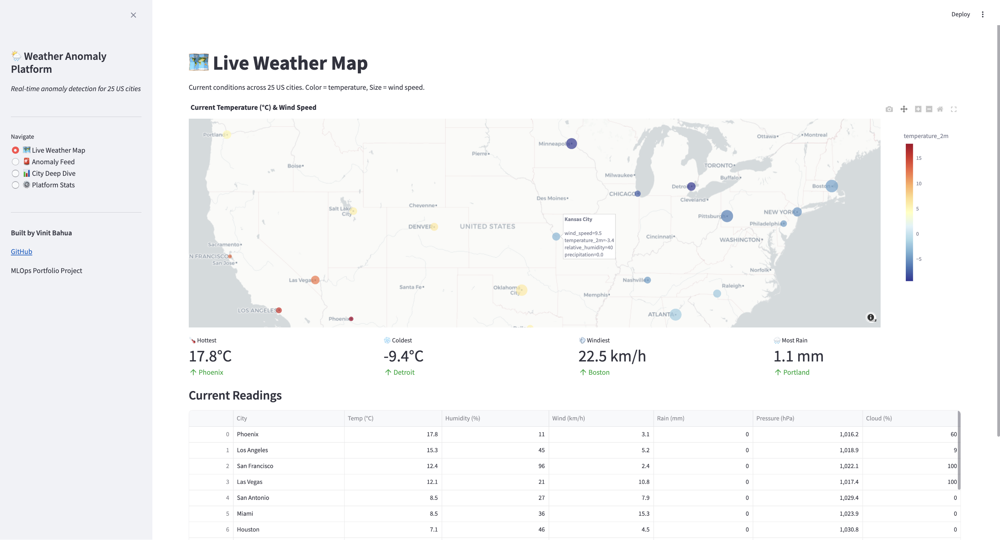
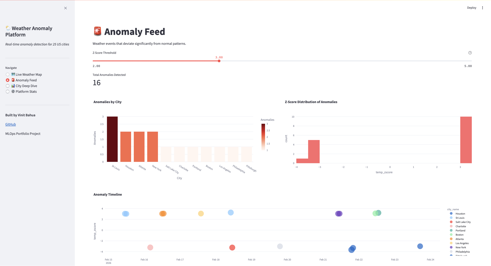
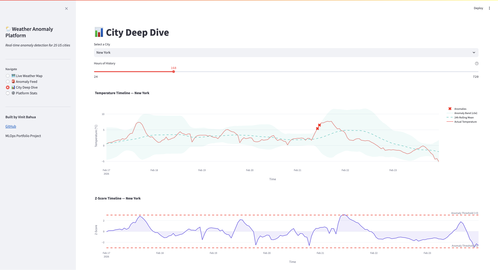
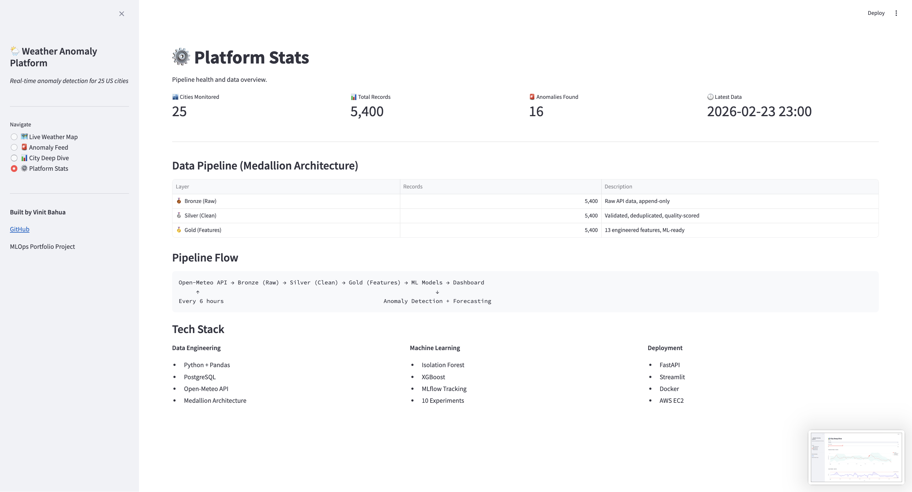
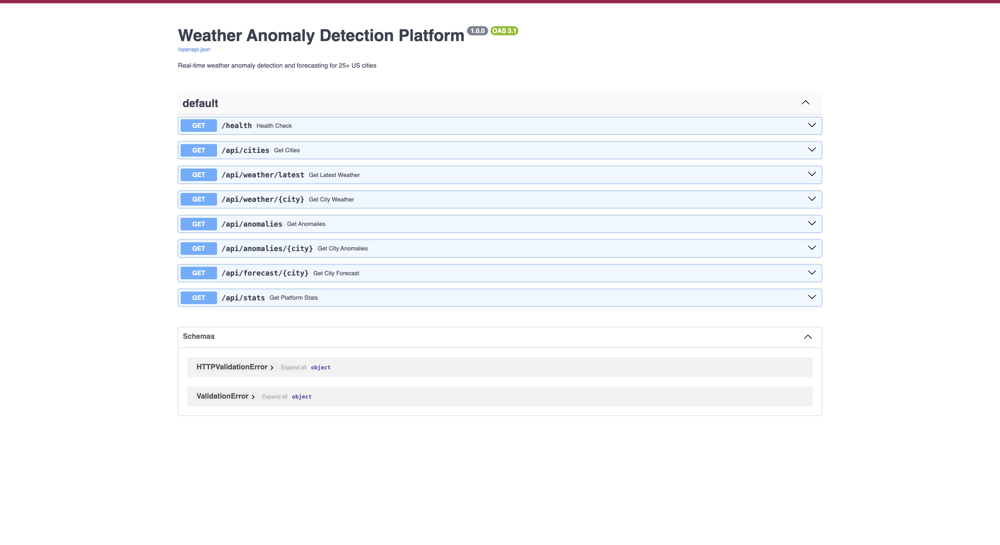

# 🌦️ Weather Anomaly Detection Platform

Real-time weather anomaly detection and forecasting for 25 US cities. End-to-end MLOps pipeline from data ingestion to deployed dashboard.

## What This Does

Pulls live weather data from 25 US cities every 6 hours, cleans and transforms it through a medallion architecture pipeline, detects anomalies using ML models, and serves everything through an interactive dashboard and REST API — all containerized with Docker and tracked with MLflow.

## Dashboard Pages

### Live Weather Map
Interactive map showing current temperature and wind speed for all 25 cities. Hover for details, color-coded by temperature.



### Anomaly Feed
Detected weather anomalies with severity scores, city breakdown, z-score distribution, and timeline visualization.



### City Deep Dive
Select any city to see temperature timeline with anomaly bands (±3σ), z-score history, humidity, wind speed, and precipitation charts.



### Platform Stats
Pipeline health overview showing medallion architecture layers, record counts, and tech stack.



### REST API
8 endpoints with auto-generated Swagger documentation.



## Architecture

```
Open-Meteo API (25 cities, every 6 hours)
    │
    ▼
┌─────────────────────────────────────────┐
│         MEDALLION ARCHITECTURE          │
│                                         │
│  Bronze (Raw) → Silver (Clean) → Gold   │
│   19,200+        Validated       13 ML  │
│   records        Quality-scored  Features│
└──────────────────┬──────────────────────┘
                   │
        ┌──────────┼──────────┐
        ▼          ▼          ▼
  Isolation     XGBoost    MLflow
  Forest        Forecast   10 Experiments
  (Anomaly)     (0.12°C    Tracked
  Detection     RMSE)
        │          │
        ▼          ▼
   FastAPI + Streamlit Dashboard
        │
        ▼
   Docker Compose (3 services)
```

## Key Results

| Metric                 | Value   |
| ---------------------- | ------- |
| Cities monitored       | 25      |
| Records processed      | 19,200+ |
| Features engineered    | 13      |
| Anomalies detected     | 60+     |
| Forecast RMSE          | 0.12°C |
| Forecast R²           | 0.9998  |
| ML experiments tracked | 10      |
| API endpoints          | 8       |
| Docker services        | 3       |

## Tech Stack

| Layer               | Tools                                      |
| ------------------- | ------------------------------------------ |
| Data Ingestion      | Python, Open-Meteo API, PostgreSQL         |
| ETL Pipeline        | Pandas, SQLAlchemy, Medallion Architecture |
| ML Models           | Isolation Forest, XGBoost, scikit-learn    |
| Experiment Tracking | MLflow (10 experiments, model registry)    |
| API                 | FastAPI (8 endpoints, Swagger docs)        |
| Dashboard           | Streamlit, Plotly                          |
| Containerization    | Docker, Docker Compose                     |
| Logging             | Loguru (structured, rotated)               |
| Testing             | pytest (13+ tests)                         |

## Quick Start

### With Docker (recommended)

```bash
git clone https://github.com/vinitbahua123/weather-anomaly-platform.git
cd weather-anomaly-platform

# Start all services
docker-compose up --build -d

# Initialize database and load data
docker exec -it weather-app python -m src.utils.database --init
docker exec -it weather-app python -m src.ingestion.weather_fetcher --backfill 7
docker exec -it weather-app python -m src.transformation.cleaner
docker exec -it weather-app python -m src.transformation.feature_engineer

# Access
# Dashboard: http://localhost:8501
# API Docs:  http://localhost:8000/docs
```

### Local Development

```bash
git clone https://github.com/vinitbahua123/weather-anomaly-platform.git
cd weather-anomaly-platform

# Setup
python3.11 -m venv venv
source venv/bin/activate
pip install -r requirements.txt
cp .env.example .env

# Start PostgreSQL (Docker)
docker run -d --name weather-postgres -e POSTGRES_DB=weather_db -e POSTGRES_USER=weather_user -e POSTGRES_PASSWORD=weather_pass_123 -p 5432:5432 postgres:15-alpine

# Initialize and run pipeline
python -m src.utils.database --init
python -m src.ingestion.weather_fetcher --backfill 7
python -m src.transformation.cleaner
python -m src.transformation.feature_engineer
python -m src.models.train

# Launch
PYTHONPATH=. uvicorn src.api.main:app --port 8000 &
PYTHONPATH=. streamlit run src/dashboard/app.py --server.port 8501
```

### Run Tests

```bash
pytest tests/ -v
```

## Project Structure

```
weather-anomaly-platform/
├── src/
│   ├── ingestion/          # Bronze layer: API data fetching
│   ├── transformation/     # Silver + Gold layers: cleaning & features
│   ├── models/             # ML training with MLflow tracking
│   ├── api/                # FastAPI REST endpoints
│   ├── dashboard/          # Streamlit interactive UI
│   └── utils/              # Database, logging, config
├── tests/                  # pytest test suite
├── docker-compose.yml      # 3-service orchestration
├── Dockerfile              # Python app container
└── requirements.txt        # Pinned dependencies
```

## How the Anomaly Detection Works

The system uses rolling z-scores to identify unusual weather patterns. For each city, it computes a 24-hour rolling mean and standard deviation of temperature. When the current reading deviates more than 3 standard deviations from the rolling mean, it's flagged as an anomaly.

This approach is powerful because it's relative to each city's recent baseline. A 0°C reading in Miami is anomalous; the same reading in Minneapolis is normal. The z-score captures this context automatically.

The Isolation Forest model adds a second layer of detection using multiple features (z-score, pressure changes, humidity-wind interaction) to catch multi-dimensional anomalies that a single z-score threshold might miss.

## API Endpoints

| Endpoint                      | Description                   |
| ----------------------------- | ----------------------------- |
| `GET /health`               | System health check           |
| `GET /api/cities`           | List all 25 monitored cities  |
| `GET /api/weather/latest`   | Latest reading for each city  |
| `GET /api/weather/{city}`   | Historical weather for a city |
| `GET /api/anomalies`        | All detected anomalies        |
| `GET /api/anomalies/{city}` | Anomalies for a specific city |
| `GET /api/forecast/{city}`  | Temperature forecast data     |
| `GET /api/stats`            | Platform statistics           |

## Built By

**Vinit Bahua** — MS Data Science, Northeastern University

* [GitHub](https://github.com/vinitbahua123)
* [LinkedIn](https://linkedin.com/in/vinitbahua)
